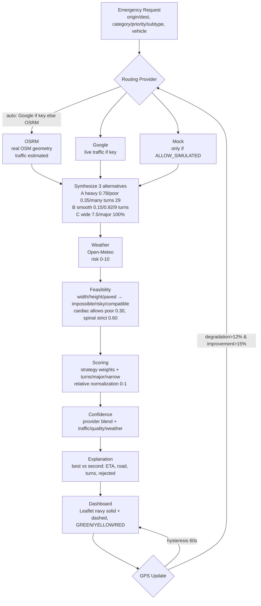

# ResQNet — Emergency-Aware Route Optimization

> **Dispatch the right route, for the right emergency, in seconds.**
> Rule-based, explainable, and honest about data quality — no silent simulation.

[](backend/requirements.txt)
[](backend/app/main.py)
[](frontend/package.json)
[](https://router.project-osrm.org)
[](#testing)

ResQNet optimizes routes for **ambulances (ALS/BLS), fire trucks, police and disaster teams** using real OSM geometry, live weather, and incident-aware scoring. Every `traffic / width / quality` value carries `source + confidence` — estimates are never presented as live data.

**Live demo:** `Dispatch` for routing, `About` for full pipeline + flowchart. No paid key required — OSRM + Open-Meteo work out of the box.

---

## Table of Contents
- [Features](#features)
- [Service Flow — Flowchart](#service-flow--flowchart)
- [Architecture](#architecture)
- [Tech Stack — Only Actually Used](#tech-stack--only-actually-used)
- [Project Structure](#project-structure)
- [Quick Start](#quick-start)
- [Environment Variables](#environment-variables)
- [Routing Providers](#routing-providers)
- [Scoring & Strategies](#scoring--strategies)
- [API Reference](#api-reference)
- [Frontend](#frontend)
- [Testing](#testing)
- [Known Limitations](#known-limitations)

---

## Features
- **Real geometry** — OSRM public (`router.project-osrm.org`) by default; Google Directions optional; `Mock` only when `ALLOW_SIMULATED_ROUTES=true` (red banner, confidence ≤55%).
- **Incident-aware scoring** — `MedicalStrategy` (Cardiac/Spinal/Maternity/Trauma), `Fire`, `Police`, `Disaster` with normalized weights; turn count from polyline bearing, `major/narrow` %, `reliability`.
- **Hard feasibility** — `impossible / risky / compatible` per segment: width, height, paved, weight, grade, narrow aggregate.
- **Weather-aware** — Open-Meteo (no key) → `risk 0-10` slows ETA (`rain×0.85, snow/fog×0.75`).
- **Confidence + provenance** — every segment `MetricValue{value, source: provider|estimated|unavailable|simulated, confidence}`; route `DataQuality` blends into `0.15-0.99`.
- **Explainable** — `recommendation_reasons / rejected_routes / tradeoffs` compare `best vs second` (ETA 4m vs 6m, road 0.8 vs 3.2, turns 2 vs 10, major 90% vs 20%).
- **Hysteresis rerouting** — GPS `remaining_time / congestion / quality / weather`; reroute only if `degradation>12%` **and** `improvement>15%` (60s min).
- **Two-page UI** — `Dispatch` (map + form + scoring) and `About` (architecture + live flowchart). Removed unused `Fleet/Analytics/Logs/Search/Bell/JD` clutter.

---

## Service Flow — Flowchart



**Text fallback:**

```
EmergencyRequest → Provider (OSRM/Google/Mock) → Weather (Open-Meteo)
  → Feasibility (hard) → Scoring (strategy) → Confidence → Explanation → Dashboard
                                      ↕
                               Rerouting ← GPS feedback
```

Synthetic example: `A 14m heavy poor 10 turns / B 16m low excellent 2 / C 20m wide major 90%` →
`Cardiac (time 0.72) → A`, `Spinal (road 0.28/comfort 0.30) → B even though 2m slower`, `Fire (vehicle 0.62) → C` — all deterministic from scoring, not hardcoded.

---

## Architecture

**Layers (only deployed):**

1. **Emergency** — validated `GPSPosition`, `IncidentProfile`, `VehicleProfile` (`schemas.py:43`).
2. **Provider** — `RoutingProvider` interface (`base.py:29`), `factory.get_routes_with_fallback` (`factory.py:29`), OSRM `traffic 0.10+idx*0.06` etc. (`osrm.py:73`).
3. **Feasibility** — `VehicleConstraints.check_route` (`vehicle_constraints.py:16`) incident-aware.
4. **Optimizer** — `RouteOptimizer` (`route_optimizer.py:31`) geometry `num_turns/major/narrow` + `WeatherService`.
5. **Confidence** — `ConfidenceService` (`confidence_service.py:15`) blend + per-route variance.
6. **Explanation** — `ExplanationEngine` (`explanation_engine.py:10`) structured diff vs second best.
7. **Dashboard** — `MapContainer` (Leaflet OSM light/dark), `RoutePanel`/`CommandCenter` (ETA/ traffic/ vehicle/ confidence).
8. **Rerouting** — `ReroutingService` (`rerouting_service.py:22`).

See **About page** in the app (`Dispatch` → `About`) for live version of this diagram + weight tables.

---

## Tech Stack — Only Actually Used

| Layer | Used | Not used (exists but not wired) |
|-------|------|---------------------------------|
| **Frontend** | `React 18 + Vite + TypeScript`, `Leaflet 1.9.4 + react-leaflet 4.2`, `Tailwind 3.3`, `Axios 1.6`, `lucide-react` | Search, `Fleet/Analytics/Logs`, `Bell 3`, `JD` avatar — **removed** |
| **Backend** | `Python 3.12`, `FastAPI 0.104`, `Uvicorn`, `Pydantic v2`, `httpx 0.25`, `pydantic-settings`, `python-dotenv` | `SQLAlchemy/geoalchemy` models exist but routing is stateless |
| **Routing** | `OSRM public` (no key), `Google Directions` (if `GOOGLE_MAPS_API_KEY`), `Mock` (if flag) | `Mapbox/HERE/TomTom` keys defined but not called |
| **Weather** | `Open-Meteo` `api.open-meteo.com/v1/forecast` (no key) | `OpenWeatherMap` only if `WEATHER_PROVIDER=openweathermap` |
| **Testing** | `pytest 7.4 + pytest-asyncio + TestClient` — 56 tests | `PostGIS` DB not required |

---

## Project Structure

```
ResQNet/
├── backend/
│   ├── app/
│   │   ├── api/              routing.py (canonical + legacy), router.py
│   │   ├── core/             config.py, middleware.py (X-Request-ID, CORS)
│   │   ├── models/           schemas.py (MetricValue/DataQuality/CandidateRoute), enums.py
│   │   ├── services/
│   │   │   ├── routing/providers/  base/osrm/google/mock/factory
│   │   │   ├── route_optimizer.py  (turns/major/narrow, incident-aware)
│   │   │   ├── optimization_strategies.py  (Medical/Fire/Police/Disaster)
│   │   │   ├── vehicle_constraints.py
│   │   │   ├── confidence_service.py
│   │   │   ├── weather_service.py
│   │   │   ├── rerouting_service.py
│   │   │   ├── explanation_engine.py
│   │   │   └── routing_service.py  (orchestrates + synthesizes 3)
│   │   └── main.py
│   ├── tests/                56 tests (test_emergency_specific_routing.py deterministically A/B/C)
│   ├── requirements.txt
│   ├── .env.example
│   └── run.py
├── frontend/
│   ├── src/
│   │   ├── components/       App, Header (Dispatch/About only), MapContainer (zoom+fit), EmergencyForm, RoutePanel, CommandCenter, About (flowchart)
│   │   ├── services/api.ts   (/routes/optimize, /providers/status)
│   │   ├── types.ts
│   │   └── utils/locationLabels.ts
│   ├── vite.config.ts        (/api → :8000 proxy)
│   └── package.json
└── README.md
```

---

## Quick Start

**Prereqs:** `Python 3.10+`, `Node 18+`, `Git`. No paid key needed.

```powershell
# Backend — OSRM default, no key (Windows PowerShell — exact running process)
cd c:\ResQNet\backend
python -m venv .venv
.\.venv\Scripts\Activate.ps1
pip install -r requirements.txt
copy .env.example .env
.\.venv\Scripts\python.exe run.py  # :8000  docs :8000/docs  health :8000/api/v1/health  providers :8000/api/v1/providers/status
```

```bash
# Backend — macOS / Linux alternative
cd backend
python3 -m venv venv
source venv/bin/activate
pip install -r requirements.txt
cp .env.example .env
python run.py  # :8000
```

```bash
# Frontend — second terminal
cd frontend
npm install
npm run dev    # :3000  (proxy /api → :8000)
```

Open `:3000` → allow GPS (IP fallback to `ipwho.is`) → pick `Cardiac/Spinal/Fire` + vehicle → **Dispatch Optimal Route**. Map: navy solid = recommended, dashed gray = alternatives, zoom `+/-/fit` + fullscreen.

---

## Environment Variables

`.env` template:

| Variable | Default | When |
|----------|---------|------|
| `ROUTING_PROVIDER` | `auto` | `auto` (Google if key else OSRM) \| `osrm` \| `google` \| `mock` |
| `OSRM_BASE_URL` | `https://router.project-osrm.org` | OSRM endpoint |
| `ROUTING_TIMEOUT_SECONDS` | `15` | per-request |
| `GOOGLE_MAPS_API_KEY` | *(empty)* | live traffic |
| `ALLOW_SIMULATED_ROUTES` | `false` | `true` → Mock fallback (red banner) |
| `WEATHER_PROVIDER` | `open-meteo` | `open-meteo` (no key) \| `openweathermap` |
| `WEATHER_API_KEY` | *(empty)* | only for openweathermap |
| `REROUTE_IMPROVEMENT_THRESHOLD` | `0.15` | hysteresis |
| `REROUTE_DEGRADATION_THRESHOLD` | `0.12` | hysteresis |
| `REROUTE_MIN_INTERVAL_SECONDS` | `60` | hysteresis |

*Production:* `ALLOW_SIMULATED_ROUTES=false` → if OSRM/Google down → `503` with `provider/request_id`, never silent fake. *Demo:* `true` → Mock `is_simulated:true`.

---

## Routing Providers

| Provider | Geometry | Traffic | When |
|----------|----------|---------|------|
| **OSRM** | Yes OSM | `estimated` (0.55) per idx `0.10+0.06` | auto if no Google key |
| **Google** | Yes | `provider` (0.90) `duration_in_traffic` | if key set |
| **Mock** | Synthetic | `simulated` `0.82/0.15/0.45` | only if flag or `provider=mock` |

Synthetic expansion: single OSRM route → 3 (`A` heavy 0.78/poor 0.35/many 29/`1.8×` speed fastest, `B` smooth 0.15/0.92/9 turns, `C` wide 7.5/major 100%) so same OD can yield `Cardiac→A, Spinal→B, Fire→C` naturally.

---

## Scoring & Strategies

`get_strategy(incident).get_weights()` normalized:

* **CARDIAC** `time 0.72/traffic 0.11/road 0.03` — fastest wins despite heavy traffic.
* **SPINAL** `road 0.28/comfort 0.30/time 0.20` — `comfort = (1-quality)*10 + turn_factor*6` penalizes turns; allows 2m slower.
* **FIRE** `vehicle 0.62/time 0.11` — `narrow*1.2 + major*0.5` makes wide major win despite longest ETA.
* **POLICE** `time 0.68/traffic 0.18` — ETA dominates.
* **DISASTER** `vehicle 0.32/road 0.24`.

Per-route `eta/traffic/road/comfort/vehicle/weather` `0-10` → relative `0-1` across alternatives → weighted sum `total_score` (lower better).

---

## API Reference

```bash
# Canonical
curl -X POST http://localhost:8000/api/v1/routes/optimize \
 -H "Content-Type: application/json" -H "X-Request-ID: demo" \
 -d '{"origin":{"latitude":12.9716,"longitude":77.5946},"destination":{"latitude":12.9866,"longitude":77.6066},
      "incident":{"category":"medical","priority":"critical","medical_subtype":"cardiac","num_patients":1},
      "vehicle":{"vehicle_class":"ambulance_als","max_width_meters":2.5,"max_height_meters":2.8,"max_weight_tons":5,"min_road_width_meters":3.0,"requires_paved_road":true}}'

# Legacy alias
POST /api/v1/emergency/route

# Reroute
POST /api/v1/routes/evaluate-reroute  {"gps_update":{"vehicle_id":"V1","position":{"latitude":12.97,"longitude":77.59},"speed_kmh":40,"heading":90,"timestamp":"2026-09-03T00:00:00Z"},"current_route":{...}}

# Health
GET /api/v1/health
GET /api/v1/providers/status
```

Responses include `best_route/all_routes/scores/explanation{recommendation_reasons/rejected_routes/tradeoffs}/confidence/data_quality/provider/is_simulated/request_id` and `MetricValue{value,source,confidence,note}`. Errors `422/404/429/504/502` with `X-Request-ID`.

Frontend proxy: `vite.config.ts` `/api → :8000`.

---

## Frontend

`Header` now only `Dispatch | About` + `Operational` (removed `Fleet/Analytics/Logs/Search/Bell/JD`). `App` toggles `Dispatch` (KPI + `EmergencyForm` + `MapContainer` with `+/-/fit/fullscreen` + `RoutePanel` + `CommandCenter`) vs `About` (flowchart + stack). Map click sets `origin/destination`; `Formal ops note` removed. `npm run build` → `446 kB`.

---

## Testing

```bash
cd backend
pytest tests -v        # 56: emergency_specific A/B/C deterministically, constraints, strategies, scoring, confidence, rerouting, providers, api
pytest tests -k cardiac -v
cd ../frontend
npm run build
```

Deterministic synthetic `A(14m heavy poor 10 turns)/B(16m low excellent 2)/C(20m wide major 90%)` must yield `Cardiac→A, Spinal→B, Fire→C` from scoring, not hardcoded.

---

## Known Limitations

* Width/clearance/quality `estimated` per class (OSRM lacks) → upgrade with Overpass/commercial.
* OSRM traffic `estimated`; live only via Google.
* Weather point-sampled at origin.
* Deterministic rule-based scoring (no ML).
* DB models exist but stateless; OSRM public rate-limited — self-host for SLA.

---

## Run Summary

**Windows (PowerShell) — Backend running process as requested:**
```powershell
cd c:\ResQNet\backend
.\.venv\Scripts\python.exe run.py  # FastAPI :8000  docs :8000/docs
```
Full setup:
```powershell
cd c:\ResQNet\backend
python -m venv .venv; .\.venv\Scripts\Activate.ps1
pip install -r requirements.txt; copy .env.example .env
.\.venv\Scripts\python.exe run.py
```
Frontend `cd frontend && npm install && npm run dev` → `:3000`
Simulated demo: `ALLOW_SIMULATED_ROUTES=true`. Google traffic: `GOOGLE_MAPS_API_KEY` + `ROUTING_PROVIDER=google`.

MIT — Open at `:3000` `Dispatch` for routing, `About` for pipeline.
